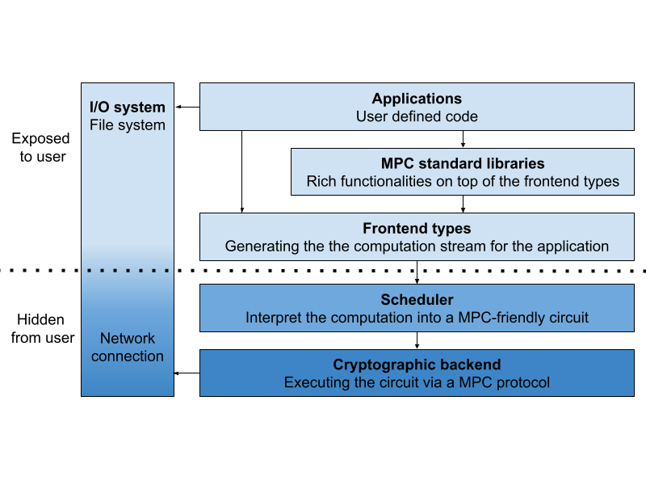

# PCF (Private Computation Framework)

## Project Description
Private Computation Framework (PCF) is the application framework for writing MPC "games" (applications) that are secure and private.  The games are typically created in C++ using private data structures provided by PCF, and evaluated using an MPC backend that operates much like a virtual machine.

We have tested PCF on AWS Cloud but we intend for it to be cloud agnostic.

We are introducing v2 of PCF.  Previously in v1, the framework depended directly on the EMP-Toolkit.  We have since then done a complete rewrite in this v2 release with the following features:

### XOR Secret Sharing Protocol
PCF v2.0 implements support for an XOR Secret Sharing MPC protocol (classical [GMW protocol](https://dl.acm.org/doi/10.1145/28395.28420) with [beaver tuples](https://link.springer.com/content/pdf/10.1007/3-540-46766-1_34.pdf)) that uses two orders of magnitude less in network traffic.  Compared to our previous version which implemented the Garbled Circuit protocol we have seen 98% cost reduction.

### Extensibility
PCF v2.0 now allows the same application to run with different underlying protocols with as simple as a configuration change.  This extensibility has also enabled us to support running MPC applications in plaintext mode for easier debugging.

### MPC Standard Libraries
In addition to providing private data types in the Frontend API, PCF v2.0 also provides a standard library containing a suite of useful tools.  For instance, we provide support for a private container that is under the hood implemented as an Oblivious RAM (ORAM).  An ORAM allows securely accessing an array of secret values with a secret index.  In addition to ORAM, we also provide other useful features such as permutor, shuffler, and sorter.

### Cloud Agnostic Buffered File I/O
MPC applications typically need to access local data that is stored in the cloud.  We provide cloud-agnostic APIs that will ease the reading and writing of your input or output datasets.



## Examples

### Example: The Billionaire Game
As an example of how you might use the PCF v2.0 APIs, we have included an example implementation of the classic [Billionaire](fbpcf/test/billionaire_problem) game.  You can run the game in two terminals representing two players.  Each player will randomly return an integer from 0 to 1000000000 to represent the amount of money they have.  The game will compare the two integers and determine who is richer.

Instructions on how to run the exmaple:
* Build the code and get the executable. Suppose the executable is `billionaire`.
* Open one terminal and run `./billionaire`.
* Open the other temianl and run `./billionaire --party=1 --server_ip=127.0.0.1`.
* Watch the results.

### Example: Private Randomized Controlled Trials
As an interesting example application on top of PCF, we implemented a library that allows developers to perform randomized controlled trials (RCT), without leaking information about who participated or what action an individual took. It uses secure multiparty computation to guarantee this privacy. It is suitable for conducting A/B testing, or measuring advertising lift and learning the aggregate statistics without sharing information on the individual level. See what is RCT [here](docs/PrivateRCT.md) and private lift games pseudocode [here](docs/PrivateLift.md).

## Full Documentation and User Guide
See full documentation for PCF 2.0 [here](docs/v2). Legacy documentation for PCF 1.0 can be found [here](docs/v1).

## Release
The latest stable image can be found in our [Github registry](https://github.com/facebookresearch/fbpcf/pkgs/container/fbpcf%2Fubuntu).

## Join the PCF community
* Website: https://github.com/facebookresearch/fbpcf

See the [CONTRIBUTING](CONTRIBUTING.md) file for how to help out.

## License
PCF and private RCT are [MIT](LICENSE) licensed, as found in the LICENSE file.

## Additional Resources on Private Computation at Meta
* [Private Computation Framework 2.0 Whitepaper](https://research.facebook.com/publications/private-computation-framework-2-0/)
* [The Value of Secure Multi-Party Computation](https://privacytech.fb.com/multi-party-computation/)
* [Building the Next Era of Personalized Experiences](https://www.facebook.com/business/news/building-the-next-era-of-personalized-experiences)
* [Privacy-Enhancing Technologies and Building for the Future](https://www.facebook.com/business/news/building-for-the-future)

## Requirements
### Dependencies for working on Ubuntu 18.04
* Compiling tools
  * gcc 8
  * clang-12
  * cmake 3.12+
* C++ libraries
  * gflags
  * re2
  * folly
* AWS SDK
* EMP toolkit

## Installing Dependencis on Ubuntu 18.04
#### Ubuntu libraries
```
sudo apt-get install -y \
    g++ \
    cmake \
    libboost-all-dev \
    libevent-dev \
    libdouble-conversion-dev \
    libgoogle-glog-dev \
    libgflags-dev \
    libiberty-dev \
    liblz4-dev \
    liblzma-dev \
    libsnappy-dev \
    make \
    zlib1g-dev \
    binutils-dev \
    libssl-dev \
    pkg-config \
    libunwind-dev \
    libjemalloc-dev
```
#### Compiling tools
* gcc 8
```
cd /root || exit
apt-add-repository -y ppa:ubuntu-toolchain-r/test
apt-get update
apt-get install -y gcc-8 g++-8
ln -sf /usr/bin/gcc-8 /usr/bin/gcc
ln -sf /usr/bin/g++-8 /usr/bin/g++
ln -sf /usr/bin/gcc /usr/bin/cc
ln -sf /usr/bin/g++ /usr/bin/c++
```
* clang-12
```
cd /root || exit
wget -O - https://apt.llvm.org/llvm-snapshot.gpg.key | apt-key add -
add-apt-repository "deb http://apt.llvm.org/bionic/   llvm-toolchain-bionic-12  main"
apt-get update
apt-get install -y clang-12 lldb-12 lld-12 clangd-12
sudo ln -s /usr/bin/clang-12 /usr/bin/clang
sudo ln -s /usr/bin/clang++-12 /usr/bin/clang++
```
* cmake 3.12+
```
cd /root || exit
wget https://cmake.org/files/v3.12/cmake-3.12.3-Linux-x86_64.sh
bash cmake-3.12.3-Linux-x86_64.sh --include-subdir --skip-license
cp cmake-3.12.3-Linux-x86_64/bin/* /usr/bin
cp -r cmake-3.12.3-Linux-x86_64/share/* /usr/share/
rm -r cmake*
```
#### C++ libraries
* gflags
```
cd /root || exit
git clone https://github.com/gflags/gflags
cd gflags || exit
mkdir build && cd build || exit
cmake ..
make && make install
```
* re2
```
cd /root || exit
# TODO: add version control
git clone https://code.googlesource.com/re2
cd re2 || exit
make
make test
sudo make install
sudo make testinstall
```
* Folly and its dependencies
```
# install googletest
cd /root || exit
wget https://github.com/google/googletest/archive/release-1.8.0.tar.gz && \
tar zxf release-1.8.0.tar.gz && \
rm -f release-1.8.0.tar.gz && \
cd googletest-release-1.8.0 || exit && \
cmake . && \
make && \
make install
# install fmt
cd /root || exit
# TODO: add version control
git clone https://github.com/fmtlib/fmt.git
cd fmt || exit
mkdir _build
cd _build || exit
cmake ..
make -j
sudo make install
# install folly
cd /root || exit
git clone https://github.com/facebook/folly.git
cd folly || exit
git checkout v2020.10.12.00
mkdir _build
cd _build || exit
cmake .. -DFOLLY_USE_JEMALLOC=0 -DCMAKE_BUILD_TYPE=Release -DCMAKE_CXX_FLAGS="-march=x86-64"
make
sudo make install
```
#### AWS SDK and its dependencies
```
cd /root || exit
sudo apt-get install -y libcurl4-openssl-dev libssl-dev uuid-dev zlib1g-dev libpulse-dev
# TODO: add version control
git clone https://github.com/aws/aws-sdk-cpp.git
cd aws-sdk-cpp || exit
git submodule update --init --recursive
mkdir build
cd build || exit
# -DCUSTOM_MEMORY_MANAGEMENT=0 is added to avoid Aws::String and std::string issue
# ref: https://github.com/aws/aws-sdk-cpp/issues/416
cmake .. -DBUILD_ONLY="s3;core" -DCMAKE_BUILD_TYPE=RelWithDebInfo -DBUILD_SHARED_LIBS=OFF -DCUSTOM_MEMORY_MANAGEMENT=0
make
sudo make install
```
#### EMP toolkit
```
#!/bin/bash

# get emp readme scripts
cd /root || exit
git clone https://github.com/emp-toolkit/emp-readme.git
cd emp-readme || exit
git checkout d31ffad00ee86f470dcb12ff50b3d88567577d1f

# install emp dependencies
cd /root || exit
bash ./emp-readme/scripts/install_packages.sh
bash ./emp-readme/scripts/install_relic.sh
#EC STRING SIZE
sed -i "s/FB_POLYN:STRING=283/FB_POLYN:STRING=251/" ~/relic/CMakeCache.txt

# get and install emp-tool
git clone https://github.com/emp-toolkit/emp-tool.git
cd emp-tool || exit
git checkout 0.2.3
cd /root/emp-tool || exit
cmake .
make
make install

# get and install emp-ot
cd /root || exit
git clone https://github.com/emp-toolkit/emp-ot.git
cd emp-ot || exit
git checkout 0.2.2
cmake .
make
make install

# get and install emp-sh2pc
cd /root || exit
git clone https://github.com/emp-toolkit/emp-sh2pc.git
cd emp-sh2pc || exit
git checkout 0.2.2
cd /root/emp-sh2pc || exit
mkdir build
cd build || exit
cmake ..
make
make install
```

## How to build a docker image that containes game executables using the given docker related files
To build the necessary docker dependencies and `fbpcf/<distro>:latest` docker image run the following script
- `./build-docker.sh`
  - build-docker currently only supports Ubuntu but we might support Alpine in the future

### Notes on `build-docker.sh`
- In order to reduce space and time of subsequent docker builds, `fbpcf` will build three dependent docker images: aws-s3-core, emp, and folly.
These are essentially treated as compiled static libraries and greatly reduces rebuilds when developing fbpcf as these libaries rarely change.
- The default build of `fbpcf/<distro>:latest` image creates a container with all the required toolchains, source and libraries to compile the fbpcf static library.  Use this image as a base image for fbpcf development.
- This image also contains example binaries `millioniare` and `billionaire` that correspond to PCF v1.0 and v2.0 respectively.
- The current dependency versions in this file are known good builds, however you may wish up update packages in the future (for development or testing)
  - UBUNTU_RELEASE="20.04"
    - Changing the Ubuntu Release will most likely require update to the apt-get packages
  - EMP_TOOL_RELEASE="0.2.3"
    - This is the git release branch for emp-tool
  - EMP_RELEASE="0.2.2"
    - This is the git release branch for emp-ot and emp-sh2pc
  - AWS_RELEASE="1.8.177"
    - This is the git release tag for https://github.com/aws/aws-sdk-cpp
  - FMT_RELEASE="7.1.3"
    - This is the git release tag for https://github.com/fmtlib/fmt
  - FOLLY_RELEASE="2021.03.29.00"
    - This is the git release tag for https://github.com/facebook/folly.git


## Citing Meta PCF


To cite Meta PCF in academic paper, please use the following BibTeX entries.

### Citing Whitepaper

@MISC {pcfwp2022,
    author       = {Shastri, Aditya  and Wu, David and Chua, Lynn  and  Zhu, Ruiyu and Davidi, Tal  and Sheng,  Yu  and  Mintz,  Josh},
    title        = "{P}rivate {C}omputation {F}ramework 2.0",
    howpublished = "{\url{https://research.facebook.com/publications/private-computation-framework-2-0/}}",
    year         = "2022"
}

### Citing PCF library

@MISC {pcf2022,
    title        = "{P}rivate {C}omputation {F}ramework 2.0",
    howpublished = "{\url{https://github.com/facebookresearch/fbpcf}}",
    year         = "2022"
}
