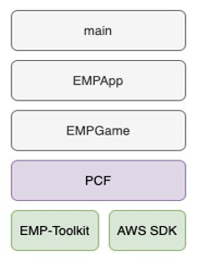

# FBPCF (Facebook Private Computation Framework)
The Private Computation Framework (PCF) library builds a scalable, secure, and distributed private computation platform to run secure computations on a production level. PCF library supports running the computation on AWS Cloud and is able to integrate various private computation technologies. Specifically, it leverages EMP-toolkit to enable privacy-preserving computations.

## Examples: Millionaire Game
The [Millionaire](example/millionaire) game is an interesting example that implemented on top of the framework. You can run the game in two terminals representing two players. Each player will randomly return an integer from 0 to 1000000000 to represent the money they have. The game will compare the two integers and determine who is richer.

Instructions on how to run the exmaple:
* Build the code and get the executable. Suppose the executable is `millionaire`.
* Open one terminal and run `./millonaire`.
* Open the other temianl and run `./millionaire --role=2 --server_ip=127.0.0.1`.
* Watch the results.

## Examples: Private Randomized Controlled Trials
As an interesting example application on top of PCF, we implemented a library that allows developers to perform randomized controlled trials (RCT), without leaking information about who participated or what action an individual took. It uses secure multiparty computation to guarantee this privacy. It is suitable for conducting A/B testing, or measuring advertising lift and learning the aggregate statistics without sharing information on the individual level. See what is RCT [here](docs/PrivateRCT.md) and private lift games pseudocode [here](docs/PrivateLift.md).

## Requirements
### Dependencies for working on Ubuntu 18.04
* Compiling tools
  * gcc 8
  * clang-12
  * cmake 3.12+
* C++ libraries
  * gflags
  * re2
  * folly
* AWS SDK
* EMP toolkit

## Installing Dependencis on Ubuntu 18.04
#### Ubuntu libraries
```
sudo apt-get install -y \
    g++ \
    cmake \
    libboost-all-dev \
    libevent-dev \
    libdouble-conversion-dev \
    libgoogle-glog-dev \
    libgflags-dev \
    libiberty-dev \
    liblz4-dev \
    liblzma-dev \
    libsnappy-dev \
    make \
    zlib1g-dev \
    binutils-dev \
    libssl-dev \
    pkg-config \
    libunwind-dev \
    libjemalloc-dev
```
#### Compiling tools
* gcc 8
```
cd /root || exit
apt-add-repository -y ppa:ubuntu-toolchain-r/test
apt-get update
apt-get install -y gcc-8 g++-8
ln -sf /usr/bin/gcc-8 /usr/bin/gcc
ln -sf /usr/bin/g++-8 /usr/bin/g++
ln -sf /usr/bin/gcc /usr/bin/cc
ln -sf /usr/bin/g++ /usr/bin/c++
```
* clang-12
```
cd /root || exit
wget -O - https://apt.llvm.org/llvm-snapshot.gpg.key | apt-key add -
add-apt-repository "deb http://apt.llvm.org/bionic/   llvm-toolchain-bionic-12  main"
apt-get update
apt-get install -y clang-12 lldb-12 lld-12 clangd-12
sudo ln -s /usr/bin/clang-12 /usr/bin/clang
sudo ln -s /usr/bin/clang++-12 /usr/bin/clang++
```
* cmake 3.12+
```
cd /root || exit
wget https://cmake.org/files/v3.12/cmake-3.12.3-Linux-x86_64.sh
bash cmake-3.12.3-Linux-x86_64.sh --include-subdir --skip-license
cp cmake-3.12.3-Linux-x86_64/bin/* /usr/bin
cp -r cmake-3.12.3-Linux-x86_64/share/* /usr/share/
rm -r cmake*
```
#### C++ libraries
* gflags
```
cd /root || exit
git clone https://github.com/gflags/gflags
cd gflags || exit
mkdir build && cd build || exit
cmake ..
make && make install
```
* re2
```
cd /root || exit
# TODO: add version control
git clone https://code.googlesource.com/re2
cd re2 || exit
make
make test
sudo make install
sudo make testinstall
```
* Folly and its dependencies
```
# install googletest
cd /root || exit
wget https://github.com/google/googletest/archive/release-1.8.0.tar.gz && \
tar zxf release-1.8.0.tar.gz && \
rm -f release-1.8.0.tar.gz && \
cd googletest-release-1.8.0 || exit && \
cmake . && \
make && \
make install
# install fmt
cd /root || exit
# TODO: add version control
git clone https://github.com/fmtlib/fmt.git
cd fmt || exit
mkdir _build
cd _build || exit
cmake ..
make -j
sudo make install
# install folly
cd /root || exit
git clone https://github.com/facebook/folly.git
cd folly || exit
git checkout v2020.10.12.00
mkdir _build
cd _build || exit
cmake .. -DFOLLY_USE_JEMALLOC=0 -DCMAKE_BUILD_TYPE=Release -DCMAKE_CXX_FLAGS="-march=native"
make
sudo make install
```
#### AWS SDK and its dependencies
```
cd /root || exit
sudo apt-get install -y libcurl4-openssl-dev libssl-dev uuid-dev zlib1g-dev libpulse-dev
# TODO: add version control
git clone https://github.com/aws/aws-sdk-cpp.git
cd aws-sdk-cpp || exit
mkdir build
cd build || exit
# -DCUSTOM_MEMORY_MANAGEMENT=0 is added to avoid Aws::String and std::string issue
# ref: https://github.com/aws/aws-sdk-cpp/issues/416
cmake .. -DBUILD_ONLY="s3;core" -DCMAKE_BUILD_TYPE=RelWithDebInfo -DBUILD_SHARED_LIBS=OFF -DCUSTOM_MEMORY_MANAGEMENT=0
make
sudo make install
```
#### EMP toolkit
```
#!/bin/bash

# get emp readme scripts
cd /root || exit
git clone https://github.com/emp-toolkit/emp-readme.git
cd emp-readme || exit
git checkout d31ffad00ee86f470dcb12ff50b3d88567577d1f

# install emp dependencies
cd /root || exit
bash ./emp-readme/scripts/install_packages.sh
bash ./emp-readme/scripts/install_relic.sh
#EC STRING SIZE
sed -i "s/FB_POLYN:STRING=283/FB_POLYN:STRING=251/" ~/relic/CMakeCache.txt

# get and install emp-tool
git clone https://github.com/emp-toolkit/emp-tool.git
cd emp-tool || exit
git checkout 9551a53befef2b07e41097bca7fcb3b4aee36262
cd /root/emp-tool || exit
cmake .
make
make install

# get and install emp-ot
cd /root || exit
git clone https://github.com/emp-toolkit/emp-ot.git
cd emp-ot || exit
git checkout a4738c5dc05169400ff68f4eb4e5d51a66263268
cmake .
make
make install

# get and install emp-sh2pc
cd /root || exit
git clone https://github.com/emp-toolkit/emp-sh2pc.git
cd emp-sh2pc || exit
git checkout 07271059d99312cfc0c6589f43fc2d9ddfe6788b
cd /root/emp-sh2pc || exit
mkdir build
cd build || exit
cmake ..
make
make install
```

## Building Aggregator and Lift Game
```
# compile standard lift and aggregator
cd /root || exit
cp /root/CMakeLists.txt /root/emp_games/
cd emp_games || exit
cmake .
make
```

## How to build a docker image that containes game executables using the given docker related files
To build the necessary docker dependencies and `fbpcf/<distro>:latest` docker image run the following script
- `./build-docker.sh`
  - build-docker currently only supports Ubuntu but we might support Alpine in the future

### Notes on `build-docker.sh`
- In order to reduce space and time of subsequent docker builds, `fbpcf` will build three dependent docker images: aws-s3-core, emp, and folly.
These are essentially treated as compiled static libraries and greatly reduces rebuilds when developing fbpcf as these libaries rarely change.
- The default build of `fbpcf/<distro>:latest` image creates a container with all the required toolchains, source and libraries to compile the fbpcf static library.  Use this image as a base image for fbpcf development.
- This image also contains a example binary `millioniare`
- The current dependency versions in this file are known good builds, however you may wish up update packages in the future (for development or testing)
  - UBUNTU_RELEASE="20.04"
    - Changing the Ubuntu Release will most likely require update to the apt-get packages
  - EMP_RELEASE="0.1"
    - This is the git release branch for EMP repos
  - AWS_RELEASE="1.8.177"
    - This is the git release tag for https://github.com/aws/aws-sdk-cpp
  - FMT_RELEASE="7.1.3"
    - This is the git release tag for https://github.com/fmtlib/fmt
  - FOLLY_RELEASE="2021.03.29.00"
    - This is the git release tag for https://github.com/facebook/folly.git

## How PCF works
Private Computation Framework enables cryptographic methods that help two parties, Alice and Bob, compute a function on each of their secret inputs and receive outputs without revealing information about the inputs to each other. Specifically, it lets the programmers implement a garbled circuit-based 2pc program.

The garbled circuit protocol happens between a Garbler and an Evaluator, and the function they compute has to be described as a Boolean circuit. Garbler compiles the function into a Boolean circuit and adds their inputs to the circuit. Garbler then garbles the circuit, which hides the value of the inputs using encryption. Garbler sends the garbled circuit to Evaluator, who adds their inputs and computes the circuit. After the computation, Garbler and Evaluator will work together to get back the output of computation in clear text.

We looked into multiple services that enable secure computation to decide on the best framework that meets the requirements of Private RCT. After comparing more than twenty secure computation services — across secret sharing, garbled circuits, and homomorphic encryption-based protocols, we chose EMP-toolkit as the best fit for our application.

## Design Principles
1. Simplicity. We hide details of C++ and MPC as much as possible. We hope every engineer is able to write an MPC game with minimal ramp-up effort.
2. Efficiency. We provide many common utilities for engineers to write a game with ease. We embrace functional programming to speed up development.
3. Test and quality. We believe testing is important given the complexity of MPC. We provide a test framework for engineers to write unit tests to validate their games. We developed a special QueueIO for two parties to communicate via an in-memory queue. This allows MPC games to be implemented as pure functions, which also makes testing easier than before.

## Architecture




### main
main is the main function in C++. It is responsible for dealing with command line arguments.

Note: AWS Sdk requires applications that use it to initialize it first ([Learn more](https://docs.aws.amazon.com/sdk-for-cpp/v1/developer-guide/basic-use.html)). PCF provides a singleton that makes sure this is only performed once. It can be invoked by calling `fbpcf::AwsSdk::aquire()` in the main() function.

### EMPApp
We defined a unified interface. As you can read the code below, it’s responsible for dealing with input data and output data. It’s also responsible for launching a game.


```
template <class GameType, class InputDataType, class OutputDataType>

class EmpApp {
 public:
   virtual void run() {
 };

 protected:
   virtual InputDataType getInputData() = 0;
   virtual void putOutputData(const OutputDataType& output) = 0;

 private:
   Role role_;
   std::string serverIp_;
   uint16_t port_;
};
```

### EMPGame

EMPGame is another unified interface. It defines MPC role and exposes a `play` method which is as simple as taking some input data and return the output data after MPC computation.

```
enum class Role { Alice = emp::ALICE, Bob = emp::BOB };

template <class IOChannel, class InputDataType, class OutputDataType>
class EmpGame : public IMpcGame<InputDataType, OutputDataType> {
 protected:
   Role role_;

 private:
   std::unique_ptr<IOChannel> ioChannel_;
 };

class IMpcGame {
 public:
   virtual const OutputDataType play(const InputDataType& inputData) const = 0;
};
```
### Other components in PCF
**/mpc**
- EmpVector
- EmpTestUtil
- QueueIO

**/common**
- Functional map/reduce
- Vector operators

**/io**
- LocalFileManager
- S3FileManager
- FileManagerUtils
- MockedFileManger for testing

**/aws**
- AwsSdk singleton
- S3Util
- Mocked S3 client


## Full documentation
See full documentation [here](docs)

## Join the PCF community
* Website: https://github.com/facebookresearch/fbpcf

See the [CONTRIBUTING](CONTRIBUTING.md) file for how to help out.

## License
PCF and private RCT are [MIT](LICENSE) licensed, as found in the LICENSE file.
